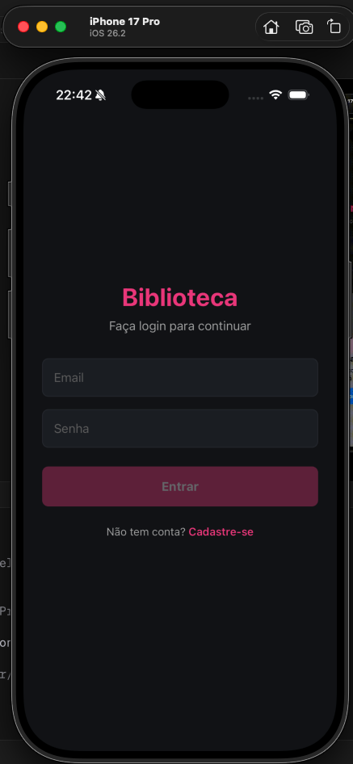
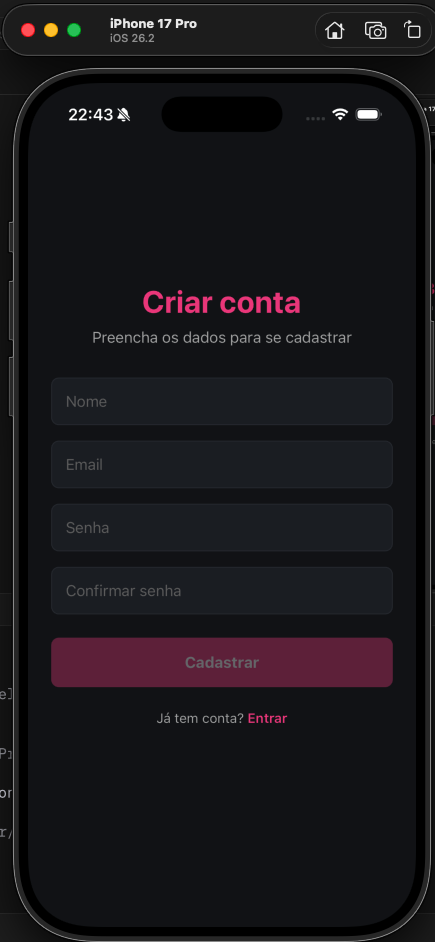

# Biblioteca Virtual FIAP

Observamos como ponto de melhoria o sistema de reservas de livros, devido à interface não intuitiva, gerando múltiplos cliques e estresse na hora de reservar um livro.

## Sobre o projeto

Biblioteca Virtual é um aplicativo mobile desenvolvido em React Native com Expo que permite ao usuário gerenciar uma lista de livros: visualizar detalhes, alugar, devolver e favoritar títulos.

O app resolve o problema de controle pessoal de leituras e empréstimos, com dados que persistem mesmo após fechar o aplicativo.

### O que mudou do CP1

| Funcionalidade | CP1 | CP2 |
|---|---|---|
| Estado dos livros | Em memória (resetava ao fechar) | Persistido com AsyncStorage |
| Autenticação | Não havia | Login e cadastro com validação completa |
| Favoritos | Não havia | Favoritar/desfavoritar com persistência |
| Temas | Apenas dark fixo | Dark/Light com alternância e persistência |
| Busca | Não havia | Busca em tempo real por título |

---

## Funcionalidades

- Autenticação completa: cadastro com validação, login com verificação, sessão persistida
- Listagem de livros: cards com capa, título, autor, ano e status
- Busca em tempo real: filtro por título conforme o usuário digita
- Favoritos: marcar/desmarcar livros com filtro dedicado
- Alugar/Devolver: controle de empréstimo por livro
- Detalhes do livro: tela individual com descrição completa
- Modo escuro e claro: alternância de tema com persistência
- Logout: encerramento de sessão com redirecionamento automático
- Persistência total: AsyncStorage para livros, sessão e tema

---

## Integrantes

Gabriel Fidalgo - RM563213

Gustavo Maia - RM562240

Gustavo Rossi - RM566075

Pedro Lima - RM565461

---

## Como rodar o projeto

Clone o projeto:

```
git clone {link do repositório}
```

Instale o Node.js versão v24.14.0 e as dependências:

```
npm install
```

Instale o aplicativo Expo Go no celular e inicie o projeto:

```
npx expo start
```

Abra o Expo Go e leia o QR Code exibido no terminal.

---

## Demonstração

### Tela de Login


### Tela de Cadastro


### Página Home


### Livros Alugados


### GIF do projeto


### Vídeo de demonstração
[Assistir vídeo](./app.mov)

---

## Decisões Técnicas

### Context API

Utilizamos Context API por ser nativa do React, sem dependências externas, e suficiente para a escala do projeto. Três contextos foram criados:

- AuthContext: gerencia sessão do usuário (login, cadastro, logout)
- BooksContext: gerencia estado dos livros (alugar, devolver, favoritar)
- ThemeContext: gerencia tema claro/escuro

### AsyncStorage

Usado para persistir quatro tipos de dados:

- `@biblioteca:users` — lista de usuários cadastrados
- `@biblioteca:session` — usuário logado atualmente
- `@app:books` — estado completo dos livros (isRent e isFavorite)
- `@app:theme` — preferência de tema do usuário

O salvamento é automático via `useEffect` com dependência no estado dos livros.

### Validação de formulário

Feita sem bibliotecas externas. Os erros são exibidos inline abaixo de cada campo e o botão reflete visualmente o estado do formulário.

### Navegação protegida

Usuários não autenticados são redirecionados automaticamente para a tela de login. Enquanto a sessão é restaurada do AsyncStorage, uma tela de carregamento é exibida para evitar flashes de conteúdo.

### Tecnologias

- React Native com Expo
- TypeScript
- expo-router para navegação baseada em arquivos

---

## Diferenciais implementados

### Modo Escuro / Tema dinâmico

Suporte a dark mode e light mode com alternância via botão no header. A preferência é salva no AsyncStorage e restaurada ao abrir o app. Aplicado em todas as telas, header e tab bar.

### Busca e filtragem em tempo real

Campo de busca na tela principal que filtra livros por título conforme o usuário digita. Combinável com o filtro de favoritos. Exibe mensagem quando nenhum resultado é encontrado.

### Favoritos

Funcionalidade de favoritar e desfavoritar livros com persistência automática. Ícone de coração em cada card e filtro dedicado na home para exibir apenas favoritos.

---

## Próximos passos

Classificação de livros por gênero e canal de contato com os responsáveis pela biblioteca.
