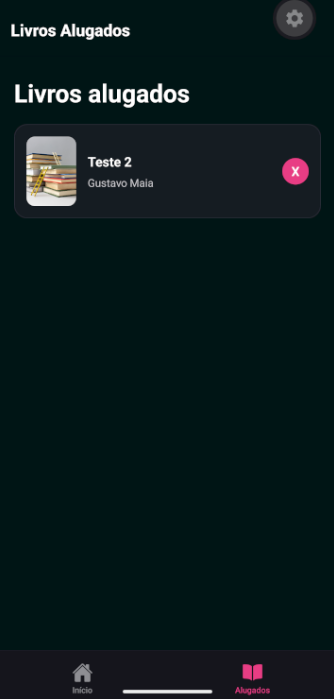
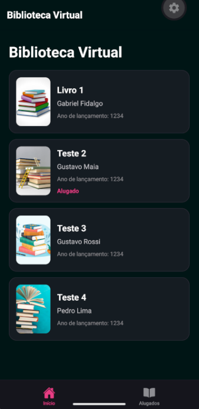

# Biblioteca Virtual FIAP

Observamos como ponto de melhoria o sistema de reservas de livros, devido à interface não intuitiva. Gerando múltiplos cliques e estresse na hora de reservar um livro.

## Funcionalidades

- Listagem de livros
- Ver detalhes de livros
- Alugar livros
- Cancelar reserva de livros
- Listagem de livros alugados

## Integrantes

Gabriel Fidalgo - RM563213

Gustavo Maia - RM562240

Gustavo Rossi - RM566075

Pedro Lima - RM565461

## Como rodar o projeto

- Clone o projeto utilizando o git

```
git clone {link do repositório}
```

- Instale o **Node.js** versão v24.14.0
- Instale as dependências do projeto:

```
npm install
```

- Instale o aplicativo **Expo Go** no celular
- Inicie o projeto:

```
npx expo start
```

- Abra o **Expo Go** e leia o **QR Code** exibido no terminal ou navegador

## Demonstrações






## Decisões Técnicas

Utilizamos TypeScript visando o uso de types, assim, deixando nosso projeto mais robusto e consolidado.

Além disso, o uso de React Native com Expo permite o desenvolvimento de um app multiplataforma com uma arquitetura (set-up) já pré-definida.

Utilizamos `expo-router` para realizar a navegação. Mais detalhes em [Expo Router](https://docs.expo.dev/versions/latest/sdk/router/).

Dentre os hooks que implementamos, estão: useContext e useState.

- Sendo o useContext para podermos acessar estados globalmente em múltiplas telas.

- E o useState para gerenciar os estados e atualizá-los.


## Próximos passos

Ainda sentimos necessidade de filtrar e buscar por livros específicos, classificá-los por gênero e ainda ter a possibilidade de entrar em contato com os responsáveis pela biblioteca.
